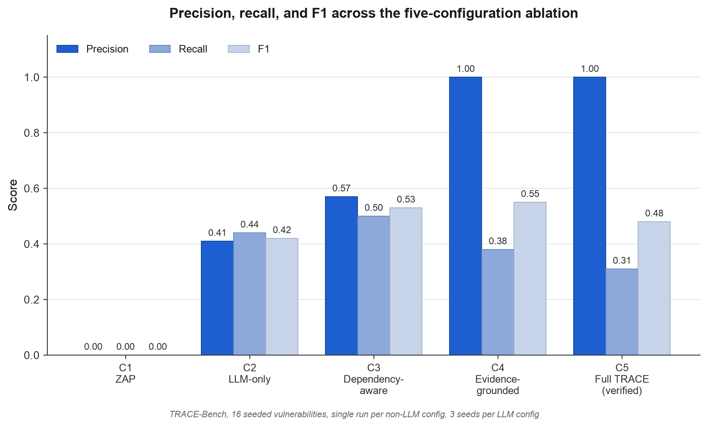
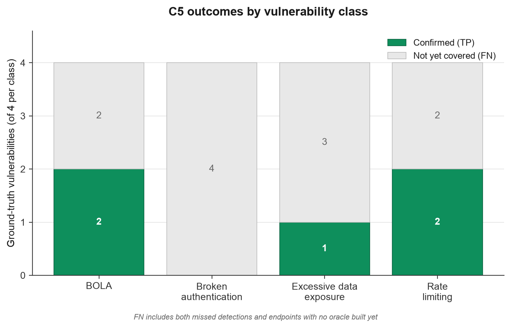
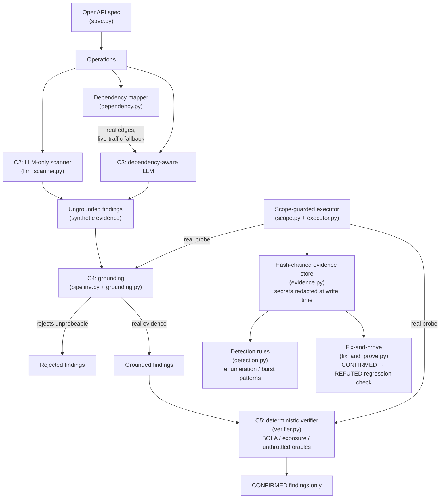

# TRACE

**Evidence-grounded, dependency-aware REST API security testing.**

**Live demo:** https://nooriqbalx.github.io/TRACE/


https://github.com/user-attachments/assets/b7274156-3ad8-4136-ae47-1423dee2adb4


TRACE finds authorization and rate-limiting vulnerabilities in REST
APIs the way most scanners can't: by tying every reported finding to a
replayable request/response pair, then independently confirming it
with a deterministic, LLM-free oracle. No finding is trusted on an
LLM's word alone.


## The result, in one number

Across a 5-configuration ablation on a 16-vulnerability benchmark:

| Config | Precision | Recall | F1 |
|---|---|---|---|
| C1 — generic DAST (OWASP ZAP) | 0.00 | 0.00 | 0.00 |
| C2 — LLM-only | 0.41 | 0.44 | 0.42 |
| C3 — dependency-aware LLM | 0.57 | 0.50 | 0.53 |
| C4 — evidence-grounded | **1.00** | 0.38 | 0.55 |
| C5 — full TRACE (verified) | **1.00** | 0.31 | 0.48 |




Grounding every claim in a real, replayable probe and confirming it
with a deterministic oracle takes precision from 0.41 to a clean
**1.00** — every finding TRACE reports is real. See
[`docs/REPORT.md`](docs/REPORT.md) for the full methodology, and
[`docs/lab/phase8-full-evaluation-run.md`](docs/lab/phase8-full-evaluation-run.md)
for the raw run, including the honest gaps.

## Why this exists

Automated fuzzers structurally can't find authorization bugs (does
this caller actually own this resource?) — they're built to probe
input validation, not identity. LLMs can reason about authorization
from an API's shape, but hallucinate: they flag things that aren't
broken and miss things that need runtime observation, not just spec
reading. TRACE is the engineering answer: ground every LLM claim in a
real probe, then verify it deterministically before ever reporting it.

## Architecture



## Quickstart

```bash
git clone https://github.com/nooriqbalx/TRACE.git
cd TRACE
uv sync
uv run pytest          # 135 tests, ~1s, no network or API keys needed
```

Run TRACE-Bench (the built-in vulnerable/patched benchmark) locally:

```bash
cd bench
uv run uvicorn tracebench.main:app --port 9000
```

Run the full evaluation (needs a Groq API key in `.env` as
`GROQ_API_KEY=...`; TRACE-Bench must be running):

```bash
uv run python experiments/eval-run-1/run_full_evaluation.py
```

## What's in the repo

| Path | What it is |
|---|---|
| `src/tracesec/` | The TRACE engine — 16 modules, 754 statements, 96% test coverage |
| `bench/` | TRACE-Bench: 24 hand-built vulnerable/patched scenario pairs (BOLA, broken auth, excessive exposure, rate limiting), each with an automated ground-truth test |
| `testbeds/` | Setup for OWASP crAPI and vAPI, two real-world deliberately-vulnerable apps used for manual exploitation and external validation |
| `docs/lab/` | Every hand-verified exploit and live evaluation run, written up with root cause, fix, and detection notes |
| `docs/EVALUATION.md` | The evaluation plan: targets, ground-truth rules, scoring, metrics |
| `docs/THREAT_MODEL.md` | STRIDE-style threat model for TRACE itself |
| `docs/RESPONSIBLE_USE.md` | Scope and safety rules TRACE enforces at the code level |
| `experiments/` | Real run artifacts: the ZAP baseline scan, the full C1–C5 evaluation |

## The engine

- **`spec.py`** — parses an OpenAPI 3.x document into a normalized operation list
- **`scope.py`** — allowlist-enforced HTTP client; blocks off-scope requests, including redirect chains
- **`evidence.py`** — SHA-256 hash-chained, tamper-evident evidence store; secrets redacted before anything touches disk
- **`executor.py`** — ties the scope guard to the evidence store, with a per-run request cap and an explicit kill switch
- **`sessions.py`** — manages ≥2 user identities per target, required for cross-identity (BOLA) checks
- **`findings.py`** — the Finding schema; every finding must cite real evidence, no exceptions
- **`dependency.py`** — infers producer/consumer relationships between operations (e.g. an appointment's `patient_id` feeding into the patients endpoint), with a live-traffic fallback for targets whose OpenAPI schema can't express field names statically
- **`llm_scanner.py`** — C2 (LLM-only) and C3 (dependency-aware LLM) scanners
- **`zap_adapter.py`** — converts OWASP ZAP's JSON report into TRACE's finding schema (C1)
- **`grounding.py`** — C4: rejects any finding not backed by a genuine, executed probe
- **`pipeline.py`** — orchestrates C4/C5: re-probes every LLM-proposed finding against the live target before it's judged
- **`verifier.py`** — C5: deterministic, LLM-free oracles (BOLA differential check, excessive-exposure field check, unthrottled-burst check) plus regression checking
- **`detection.py`** — recognizes TRACE's own attack traffic (enumeration, burst patterns) in evidence logs
- **`fix_and_prove.py`** — runs a verifier oracle before and after a fix, confirming the verdict actually flips
- **`scoring.py`** — precision/recall/F1 scoring against ground truth, matching the rules in `docs/EVALUATION.md`

## Manual work behind the automation

Every oracle in `verifier.py` generalizes something done by hand first.
`verify_bola` is the differential test manually run against crAPI's
vehicle-location and mechanic-report endpoints
([`docs/lab/crapi-manual-notes.md`](docs/lab/crapi-manual-notes.md)).
`verify_unthrottled` is the manual OTP brute-force test (201 guesses,
4 seconds, no lockout) generalized into a bounded, reusable oracle.

## Limitations

- Single author, single evaluator.
- TRACE-Bench is author-built; its results are reported separately
  from crAPI and vAPI in the evaluation methodology.
- 11 of TRACE-Bench's 16 ground-truth vulnerabilities have a working
  C4/C5 oracle; the remaining 5 (predictable session tokens, token
  expiry, reset-token reuse, list-endpoint filter bypass, leaked
  exception detail) are a stated, explicit scope boundary — see
  `KNOWN_UNCOVERED` in `experiments/eval-run-1/run_full_evaluation.py`.
- LLM configurations were run once at temperature 0 against a single
  model (GPT-OSS-120B); a genuine nondeterminism/multi-model
  comparison is future work.
- A cloud-layer evidence extension (correlating findings with IAM/
  security-group misconfigurations) was scoped, then deliberately cut
  — the time and billing/card requirements weren't justified relative
  to TRACE's core contribution.

## Related tools

TRACE builds on ideas from RESTler's stateful fuzzing and namespace
rules (Atlidakis et al., ICST 2020), OWASP ZAP as a generic DAST
baseline, and the broader line of work on LLM-assisted API testing
(LogiAgent, ARMeta) that this project's C2/C3 baselines are directly
comparable to. See [`docs/RELATED_WORK.md`](docs/RELATED_WORK.md).

## License

MIT — see [LICENSE](LICENSE).
